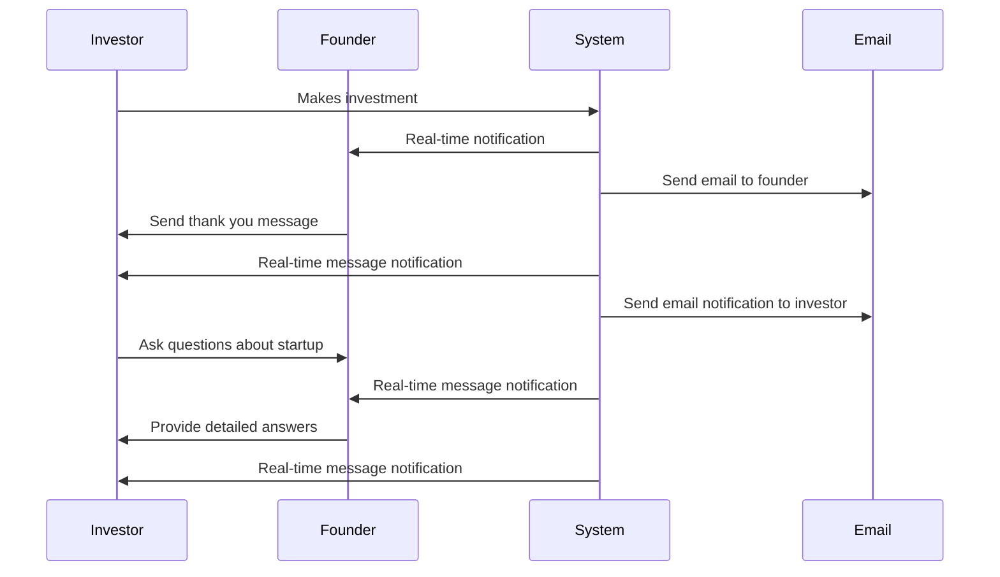
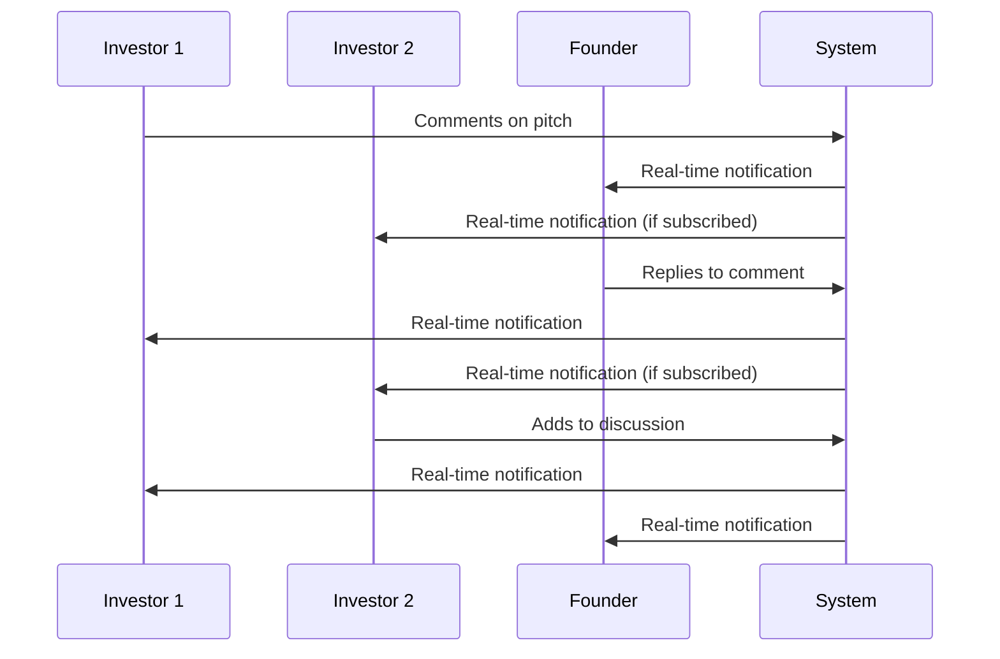

# Communication System Design

## Overview

The angel investing platform requires a comprehensive communication system supporting real-time messaging, notifications, comments, and collaboration features between startups, investors, and platform administrators.

## Communication Architecture

```
┌─────────────────────────────────────────────────────────────────┐
│                        CLIENT                                   │
├─────────────────────────────────────────────────────────────────┤
│  ┌─────────────┐  ┌─────────────┐  ┌─────────────┐              │
│  │  Messages   │  │  Comments   │  │  Real-time  │              │
│  │  Interface  │  │  System     │  │  Updates    │              │
│  │             │  │             │  │             │              │
│  └─────────────┘  └─────────────┘  └─────────────┘              │
└─────────────────┬───────────────────────────────────────────────┘
                  │ WebSocket/HTTP
                  ▼
┌─────────────────────────────────────────────────────────────────┐
│                      APPLICATION                                 │
├─────────────────────────────────────────────────────────────────┤
│  ┌─────────────┐  ┌─────────────┐  ┌─────────────┐              │
│  │  Message    │  │  Notification│  │  Email      │              │
│  │  Service    │  │  Service    │  │  Service    │              │
│  │             │  │             │  │             │              │
│  └─────────────┘  └─────────────┘  └─────────────┘              │
└─────────────────┬───────────────────────────────────────────────┘
                  │
         ┌────────▼────────┐
         │   QUEUE         │
         │   SYSTEM        │
         │   (BullMQ)      │
         └─────────────────┘
                  │
         ┌────────▼────────┐
         │   EXTERNAL      │
         │   SERVICES      │
         │   (Email/Push)  │
         └─────────────────┘
```

## Messaging System

### Core Message Service

```typescript
// lib/services/message.service.ts
import { prisma } from '@/lib/prisma'
import { notificationQueue } from '@/lib/queue'

export class MessageService {
  static async sendMessage(data: {
    senderId: string
    receiverId: string
    pitchId?: string
    investmentId?: string
    subject: string
    content: string
    messageType?: 'GENERAL' | 'PITCH_INQUIRY' | 'INVESTMENT_DISCUSSION' | 'SUPPORT'
  }): Promise<any> {
    // Create message record
    const message = await prisma.message.create({
      data: {
        sender_id: data.senderId,
        receiver_id: data.receiverId,
        pitch_id: data.pitchId,
        investment_id: data.investmentId,
        subject: data.subject,
        content: data.content,
        message_type: data.messageType || 'GENERAL'
      },
      include: {
        sender: {
          select: { id: true, name: true, avatar_url: true }
        },
        receiver: {
          select: { id: true, name: true }
        }
      }
    })

    // Queue notification for receiver
    await notificationQueue.add('message_notification', {
      userId: data.receiverId,
      type: 'MESSAGE',
      title: `New message from ${message.sender.name}`,
      content: data.subject,
      data: {
        messageId: message.id,
        senderId: data.senderId,
        pitchId: data.pitchId,
        investmentId: data.investmentId
      },
      channels: ['DATABASE', 'EMAIL']
    })

    // Emit real-time event
    socketManager.emitToUser(data.receiverId, 'new_message', {
      message: {
        id: message.id,
        subject: message.subject,
        content: message.content,
        sender: message.sender,
        created_at: message.created_at,
        is_read: false
      }
    })

    return message
  }

  static async getConversation(
    userId1: string,
    userId2: string,
    pitchId?: string,
    investmentId?: string
  ): Promise<any[]> {
    return prisma.message.findMany({
      where: {
        OR: [
          {
            sender_id: userId1,
            receiver_id: userId2
          },
          {
            sender_id: userId2,
            receiver_id: userId1
          }
        ],
        pitch_id: pitchId,
        investment_id: investmentId
      },
      include: {
        sender: {
          select: { id: true, name: true, avatar_url: true }
        }
      },
      orderBy: { created_at: 'asc' }
    })
  }

  static async markAsRead(messageId: string, userId: string): Promise<void> {
    await prisma.message.updateMany({
      where: {
        id: messageId,
        receiver_id: userId
      },
      data: {
        is_read: true,
        read_at: new Date()
      }
    })
  }

  static async getUnreadCount(userId: string): Promise<number> {
    return prisma.message.count({
      where: {
        receiver_id: userId,
        is_read: false
      }
    })
  }
}
```

### Message API Endpoints

```typescript
// routes/api/messages/index.ts
import { NextRequest } from 'next/server'
import { auth } from '@/auth'
import { MessageService } from '@/lib/services/message.service'

export async function GET(request: NextRequest) {
  try {
    const session = await auth.api.getSession({
      headers: request.headers
    })

    if (!session?.user) {
      return Response.json({ error: 'Unauthorized' }, { status: 401 })
    }

    const { searchParams } = new URL(request.url)
    const otherUserId = searchParams.get('user_id')
    const pitchId = searchParams.get('pitch_id')
    const investmentId = searchParams.get('investment_id')
    const page = parseInt(searchParams.get('page') || '1')
    const limit = Math.min(parseInt(searchParams.get('limit') || '20'), 50)

    if (otherUserId) {
      // Get conversation with specific user
      const messages = await MessageService.getConversation(
        session.user.id,
        otherUserId,
        pitchId || undefined,
        investmentId || undefined
      )

      return Response.json({ messages })
    } else {
      // Get all conversations for user
      const conversations = await MessageService.getUserConversations(
        session.user.id,
        page,
        limit
      )

      return Response.json({ conversations })
    }

  } catch (error) {
    console.error('Failed to fetch messages:', error)
    return Response.json(
      { error: 'Failed to fetch messages' },
      { status: 500 }
    )
  }
}

export async function POST(request: NextRequest) {
  try {
    const session = await auth.api.getSession({
      headers: request.headers
    })

    if (!session?.user) {
      return Response.json({ error: 'Unauthorized' }, { status: 401 })
    }

    const { receiver_id, pitch_id, investment_id, subject, content, message_type } = await request.json()

    if (!receiver_id || !subject || !content) {
      return Response.json(
        { error: 'Missing required fields' },
        { status: 400 }
      )
    }

    const message = await MessageService.sendMessage({
      senderId: session.user.id,
      receiverId: receiver_id,
      pitchId: pitch_id,
      investmentId: investment_id,
      subject,
      content,
      messageType: message_type
    })

    return Response.json({ message })

  } catch (error) {
    console.error('Failed to send message:', error)
    return Response.json(
      { error: 'Failed to send message' },
      { status: 500 }
    )
  }
}
```

## Comment System

### Pitch Comments

```typescript
// lib/services/comment.service.ts
export class CommentService {
  static async addComment(data: {
    pitchId: string
    userId: string
    content: string
    parentCommentId?: string
  }): Promise<any> {
    // Create comment record
    const comment = await prisma.comment.create({
      data: {
        pitch_id: data.pitchId,
        user_id: data.userId,
        content: data.content,
        parent_comment_id: data.parentCommentId
      },
      include: {
        user: {
          select: { id: true, name: true, avatar_url: true, role: true }
        },
        parent_comment: {
          include: {
            user: {
              select: { id: true, name: true }
            }
          }
        },
        replies: {
          include: {
            user: {
              select: { id: true, name: true, avatar_url: true }
            }
          },
          orderBy: { created_at: 'asc' }
        }
      }
    })

    // Update pitch comment count
    await prisma.pitch.update({
      where: { id: data.pitchId },
      data: {
        comment_count: {
          increment: 1
        }
      }
    })

    // Queue notification for pitch followers
    await this.notifyPitchFollowers(data.pitchId, comment)

    // Emit real-time event
    socketManager.emitToPitch(data.pitchId, 'new_comment', {
      comment: {
        id: comment.id,
        content: comment.content,
        user: comment.user,
        parent_comment: comment.parent_comment,
        replies: comment.replies,
        created_at: comment.created_at
      }
    })

    return comment
  }

  static async getPitchComments(pitchId: string, page: number = 1, limit: number = 20): Promise<any> {
    return prisma.comment.findMany({
      where: {
        pitch_id: pitchId,
        parent_comment_id: null // Only top-level comments
      },
      include: {
        user: {
          select: { id: true, name: true, avatar_url: true, role: true }
        },
        replies: {
          include: {
            user: {
              select: { id: true, name: true, avatar_url: true }
            }
          },
          orderBy: { created_at: 'asc' }
        },
        _count: {
          select: { replies: true }
        }
      },
      orderBy: { created_at: 'desc' },
      take: limit,
      skip: (page - 1) * limit
    })
  }

  private static async notifyPitchFollowers(pitchId: string, comment: any): Promise<void> {
    // Get pitch and startup info
    const pitch = await prisma.pitch.findUnique({
      where: { id: pitchId },
      include: { startup: { include: { founder: true } } }
    })

    if (!pitch) return

    // Notify startup founder
    await notificationQueue.add('comment_notification', {
      userId: pitch.startup.founder_id,
      type: 'PITCH_UPDATE',
      title: 'New Comment on Your Pitch',
      content: `${comment.user.name} commented on "${pitch.title}"`,
      data: {
        pitchId: pitchId,
        commentId: comment.id
      },
      channels: ['DATABASE']
    })

    // Notify investors who have shown interest
    const interestedInvestors = await prisma.investment.findMany({
      where: {
        pitch_id: pitchId,
        status: { in: ['PENDING', 'ESCROW', 'COMPLETED'] }
      },
      select: { investor_id: true }
    })

    for (const investment of interestedInvestors) {
      await notificationQueue.add('comment_notification', {
        userId: investment.investor_id,
        type: 'PITCH_UPDATE',
        title: 'New Comment on Pitch',
        content: `${comment.user.name} commented on "${pitch.title}"`,
        data: {
          pitchId: pitchId,
          commentId: comment.id
        },
        channels: ['DATABASE']
      })
    }
  }
}
```

## Notification System

### Notification Service

```typescript
// lib/services/notification.service.ts
import { prisma } from '@/lib/prisma'

export class NotificationService {
  static async createNotification(data: {
    userId: string
    type: 'INVESTMENT_UPDATE' | 'MESSAGE' | 'PITCH_UPDATE' | 'SYSTEM' | 'PAYMENT'
    title: string
    content: string
    data?: Record<string, any>
    actionUrl?: string
    priority?: 'LOW' | 'MEDIUM' | 'HIGH'
  }): Promise<any> {
    return prisma.notification.create({
      data: {
        user_id: data.userId,
        type: data.type,
        title: data.title,
        content: data.content,
        data: data.data,
        action_url: data.actionUrl,
        priority: data.priority || 'MEDIUM'
      }
    })
  }

  static async getUserNotifications(
    userId: string,
    options: {
      page?: number
      limit?: number
      isRead?: boolean
      type?: string
    } = {}
  ): Promise<any> {
    const { page = 1, limit = 20, isRead, type } = options

    return prisma.notification.findMany({
      where: {
        user_id: userId,
        ...(isRead !== undefined && { is_read: isRead }),
        ...(type && { type: type })
      },
      orderBy: { created_at: 'desc' },
      take: limit,
      skip: (page - 1) * limit
    })
  }

  static async markAsRead(notificationId: string, userId: string): Promise<void> {
    await prisma.notification.updateMany({
      where: {
        id: notificationId,
        user_id: userId
      },
      data: {
        is_read: true,
        read_at: new Date()
      }
    })
  }

  static async markAllAsRead(userId: string): Promise<void> {
    await prisma.notification.updateMany({
      where: {
        user_id: userId,
        is_read: false
      },
      data: {
        is_read: true,
        read_at: new Date()
      }
    })
  }

  static async getUnreadCount(userId: string): Promise<number> {
    return prisma.notification.count({
      where: {
        user_id: userId,
        is_read: false
      }
    })
  }

  static async cleanupOldNotifications(): Promise<void> {
    // Delete notifications older than 90 days
    const ninetyDaysAgo = new Date()
    ninetyDaysAgo.setDate(ninetyDaysAgo.getDate() - 90)

    await prisma.notification.deleteMany({
      where: {
        created_at: { lt: ninetyDaysAgo },
        is_read: true
      }
    })
  }
}
```

### Notification API

```typescript
// routes/api/notifications/index.ts
import { NextRequest } from 'next/server'
import { auth } from '@/auth'
import { NotificationService } from '@/lib/services/notification.service'

export async function GET(request: NextRequest) {
  try {
    const session = await auth.api.getSession({
      headers: request.headers
    })

    if (!session?.user) {
      return Response.json({ error: 'Unauthorized' }, { status: 401 })
    }

    const { searchParams } = new URL(request.url)
    const page = parseInt(searchParams.get('page') || '1')
    const limit = parseInt(searchParams.get('limit') || '20')
    const isRead = searchParams.get('is_read')
    const type = searchParams.get('type')

    const notifications = await NotificationService.getUserNotifications(
      session.user.id,
      {
        page,
        limit,
        isRead: isRead ? isRead === 'true' : undefined,
        type: type || undefined
      }
    )

    return Response.json({ notifications })

  } catch (error) {
    console.error('Failed to fetch notifications:', error)
    return Response.json(
      { error: 'Failed to fetch notifications' },
      { status: 500 }
    )
  }
}

export async function PUT(request: NextRequest) {
  try {
    const session = await auth.api.getSession({
      headers: request.headers
    })

    if (!session?.user) {
      return Response.json({ error: 'Unauthorized' }, { status: 401 })
    }

    const { action } = await request.json()

    if (action === 'mark_all_read') {
      await NotificationService.markAllAsRead(session.user.id)
      return Response.json({ success: true })
    }

    return Response.json({ error: 'Invalid action' }, { status: 400 })

  } catch (error) {
    console.error('Failed to update notifications:', error)
    return Response.json(
      { error: 'Failed to update notifications' },
      { status: 500 }
    )
  }
}
```

## Real-time Communication Features

### WebSocket Event Handlers

```typescript
// lib/websocket/handlers.ts
import { socketManager } from '@/lib/socket'
import { MessageService } from '@/lib/services/message.service'
import { CommentService } from '@/lib/services/comment.service'

export class CommunicationEventHandlers {
  static handleMessage(socket: any, data: {
    receiverId: string
    pitchId?: string
    investmentId?: string
    subject: string
    content: string
    type: string
  }) {
    const senderId = socket.data.user.id

    MessageService.sendMessage({
      senderId,
      receiverId: data.receiverId,
      pitchId: data.pitchId,
      investmentId: data.investmentId,
      subject: data.subject,
      content: data.content,
      messageType: data.type
    }).catch(console.error)
  }

  static handleComment(socket: any, data: {
    pitchId: string
    content: string
    parentCommentId?: string
  }) {
    const userId = socket.data.user.id

    CommentService.addComment({
      pitchId: data.pitchId,
      userId,
      content: data.content,
      parentCommentId: data.parentCommentId
    }).catch(console.error)
  }

  static handleTyping(socket: any, data: {
    conversationId: string
    isTyping: boolean
  }) {
    const userId = socket.data.user.id

    // Emit typing indicator to other participants
    socketManager.emitToConversation(data.conversationId, 'user_typing', {
      userId,
      isTyping: data.isTyping,
      userName: socket.data.user.name
    })
  }

  static handlePitchSubscription(socket: any, pitchId: string) {
    socket.join(`pitch:${pitchId}`)

    // Send recent comments and messages
    this.sendRecentPitchActivity(socket, pitchId)
  }

  static handleInvestmentRoomJoin(socket: any, investmentId: string) {
    socket.join(`investment:${investmentId}`)

    // Send recent investment-related messages
    this.sendRecentInvestmentActivity(socket, investmentId)
  }

  private static async sendRecentPitchActivity(socket: any, pitchId: string) {
    const recentComments = await CommentService.getPitchComments(pitchId, 1, 10)

    socket.emit('recent_comments', {
      comments: recentComments
    })
  }

  private static async sendRecentInvestmentActivity(socket: any, investmentId: string) {
    const recentMessages = await prisma.message.findMany({
      where: { investment_id: investmentId },
      include: {
        sender: {
          select: { id: true, name: true, avatar_url: true }
        }
      },
      orderBy: { created_at: 'desc' },
      take: 20
    })

    socket.emit('recent_messages', {
      messages: recentMessages.reverse()
    })
  }
}
```

## Email Integration

### Email Templates and Service

```typescript
// lib/services/email.service.ts
import { notificationQueue } from '@/lib/queue'

export class EmailService {
  static async sendInvestmentConfirmation(investment: any): Promise<void> {
    const emailData = {
      to: investment.investor.email,
      template: 'investment-confirmation',
      variables: {
        investorName: investment.investor.name,
        startupName: investment.pitch.startup.name,
        amount: investment.amount,
        pitchTitle: investment.pitch.title,
        nextSteps: [
          'Complete KYC verification if required',
          'Upload investment agreement',
          'Monitor escrow status'
        ]
      }
    }

    await notificationQueue.add('send_email', emailData)
  }

  static async sendPitchUpdate(pitch: any, updateType: string): Promise<void> {
    // Get all investors who have shown interest in this pitch
    const interestedInvestors = await prisma.investment.findMany({
      where: {
        pitch_id: pitch.id,
        status: { in: ['PENDING', 'ESCROW', 'COMPLETED'] }
      },
      include: { investor: true }
    })

    for (const investment of interestedInvestors) {
      const emailData = {
        to: investment.investor.email,
        template: 'pitch-update',
        variables: {
          investorName: investment.investor.name,
          pitchTitle: pitch.title,
          startupName: pitch.startup.name,
          updateType: updateType,
          pitchUrl: `${process.env.FRONTEND_URL}/pitches/${pitch.id}`
        }
      }

      await notificationQueue.add('send_email', emailData)
    }
  }

  static async sendMessageNotification(message: any): Promise<void> {
    const emailData = {
      to: message.receiver.email,
      template: 'new-message',
      variables: {
        recipientName: message.receiver.name,
        senderName: message.sender.name,
        subject: message.subject,
        messagePreview: message.content.substring(0, 100) + '...',
        messageUrl: `${process.env.FRONTEND_URL}/messages/${message.sender.id}`
      }
    }

    await notificationQueue.add('send_email', emailData)
  }
}
```

## Communication Workflows

### Investment Communication Flow



### Pitch Comment Flow



## Zustand Communication Store

### Message Store

```typescript
// stores/message-store.ts
import { create } from 'zustand'

interface Message {
  id: string
  sender: { id: string; name: string; avatar_url?: string }
  receiver: { id: string; name: string }
  subject: string
  content: string
  is_read: boolean
  created_at: string
  pitch_id?: string
  investment_id?: string
}

interface MessageState {
  conversations: Record<string, Message[]>
  activeConversation: string | null
  unreadCount: number
  isLoading: boolean

  // Actions
  setActiveConversation: (conversationId: string) => void
  addMessage: (message: Message) => void
  markAsRead: (messageId: string) => void
  setUnreadCount: (count: number) => void
  loadConversation: (userId: string, pitchId?: string, investmentId?: string) => Promise<void>
}

export const useMessageStore = create<MessageState>((set, get) => ({
  conversations: {},
  activeConversation: null,
  unreadCount: 0,
  isLoading: false,

  setActiveConversation: (conversationId) => {
    set({ activeConversation: conversationId })
  },

  addMessage: (message) => {
    const { conversations, activeConversation } = get()
    const conversationKey = message.pitch_id || message.investment_id || 'general'

    if (!conversations[conversationKey]) {
      conversations[conversationKey] = []
    }

    conversations[conversationKey].push(message)
    set({ conversations: { ...conversations } })

    // Update unread count if message is not from current user
    if (message.receiver.id === 'current_user_id') {
      set({ unreadCount: get().unreadCount + 1 })
    }
  },

  markAsRead: (messageId) => {
    const { conversations } = get()

    Object.keys(conversations).forEach(key => {
      conversations[key] = conversations[key].map(msg =>
        msg.id === messageId ? { ...msg, is_read: true } : msg
      )
    })

    set({ conversations: { ...conversations } })
    set({ unreadCount: Math.max(0, get().unreadCount - 1) })
  },

  setUnreadCount: (count) => {
    set({ unreadCount: count })
  },

  loadConversation: async (userId, pitchId, investmentId) => {
    set({ isLoading: true })

    try {
      const response = await fetch(`/api/messages?user_id=${userId}${pitchId ? `&pitch_id=${pitchId}` : ''}${investmentId ? `&investment_id=${investmentId}` : ''}`)
      const { messages } = await response.json()

      const conversationKey = pitchId || investmentId || 'general'
      set({ conversations: { ...get().conversations, [conversationKey]: messages } })
    } catch (error) {
      console.error('Failed to load conversation:', error)
    } finally {
      set({ isLoading: false })
    }
  }
}))
```

### Notification Store

```typescript
// stores/notification-store.ts
import { create } from 'zustand'

interface Notification {
  id: string
  type: string
  title: string
  content: string
  is_read: boolean
  created_at: string
  action_url?: string
  data?: Record<string, any>
}

interface NotificationState {
  notifications: Notification[]
  unreadCount: number
  isLoading: boolean

  // Actions
  addNotification: (notification: Notification) => void
  markAsRead: (notificationId: string) => void
  markAllAsRead: () => void
  setUnreadCount: (count: number) => void
  loadNotifications: () => Promise<void>
}

export const useNotificationStore = create<NotificationState>((set, get) => ({
  notifications: [],
  unreadCount: 0,
  isLoading: false,

  addNotification: (notification) => {
    const { notifications } = get()
    const updatedNotifications = [notification, ...notifications]

    set({ notifications: updatedNotifications })

    if (!notification.is_read) {
      set({ unreadCount: get().unreadCount + 1 })
    }
  },

  markAsRead: (notificationId) => {
    const { notifications } = get()

    const updatedNotifications = notifications.map(notif =>
      notif.id === notificationId ? { ...notif, is_read: true } : notif
    )

    set({ notifications: updatedNotifications })
    set({ unreadCount: Math.max(0, get().unreadCount - 1) })
  },

  markAllAsRead: () => {
    const { notifications } = get()

    const updatedNotifications = notifications.map(notif => ({
      ...notif,
      is_read: true
    }))

    set({ notifications: updatedNotifications, unreadCount: 0 })
  },

  setUnreadCount: (count) => {
    set({ unreadCount: count })
  },

  loadNotifications: async () => {
    set({ isLoading: true })

    try {
      const response = await fetch('/api/notifications')
      const { notifications } = await response.json()

      const unreadCount = notifications.filter((n: Notification) => !n.is_read).length

      set({ notifications, unreadCount })
    } catch (error) {
      console.error('Failed to load notifications:', error)
    } finally {
      set({ isLoading: false })
    }
  }
}))
```

## Communication Analytics

### Message Analytics

```typescript
// lib/analytics/communication-analytics.ts
export class CommunicationAnalytics {
  static async getMessageStats(userId: string, period: 'day' | 'week' | 'month' = 'week'): Promise<any> {
    const startDate = new Date()
    switch (period) {
      case 'day':
        startDate.setDate(startDate.getDate() - 1)
        break
      case 'week':
        startDate.setDate(startDate.getDate() - 7)
        break
      case 'month':
        startDate.setMonth(startDate.getMonth() - 1)
        break
    }

    const [sentCount, receivedCount, unreadCount] = await Promise.all([
      prisma.message.count({
        where: {
          sender_id: userId,
          created_at: { gte: startDate }
        }
      }),
      prisma.message.count({
        where: {
          receiver_id: userId,
          created_at: { gte: startDate }
        }
      }),
      prisma.message.count({
        where: {
          receiver_id: userId,
          is_read: false
        }
      })
    ])

    return {
      sent: sentCount,
      received: receivedCount,
      unread: unreadCount,
      total: sentCount + receivedCount
    }
  }

  static async getPitchEngagement(pitchId: string): Promise<any> {
    const [commentCount, messageCount, viewCount] = await Promise.all([
      prisma.comment.count({
        where: { pitch_id: pitchId }
      }),
      prisma.message.count({
        where: { pitch_id: pitchId }
      }),
      prisma.pitch.findUnique({
        where: { id: pitchId },
        select: { view_count: true }
      })
    ])

    return {
      comments: commentCount,
      messages: messageCount,
      views: viewCount?.view_count || 0,
      total_engagement: commentCount + messageCount + (viewCount?.view_count || 0)
    }
  }
}
```

This communication system design provides a comprehensive foundation for all communication needs in the angel investing platform, supporting real-time messaging, notifications, comments, and collaboration features with proper scalability and user experience considerations.