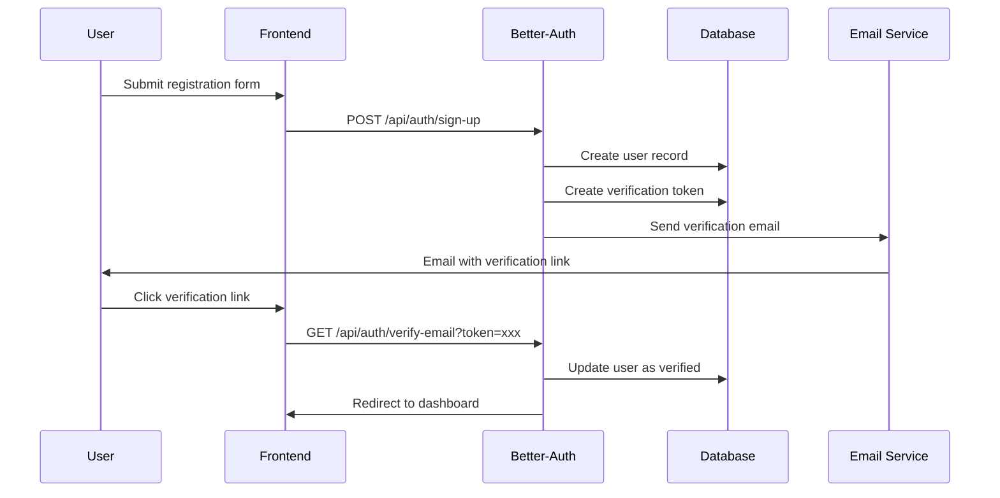
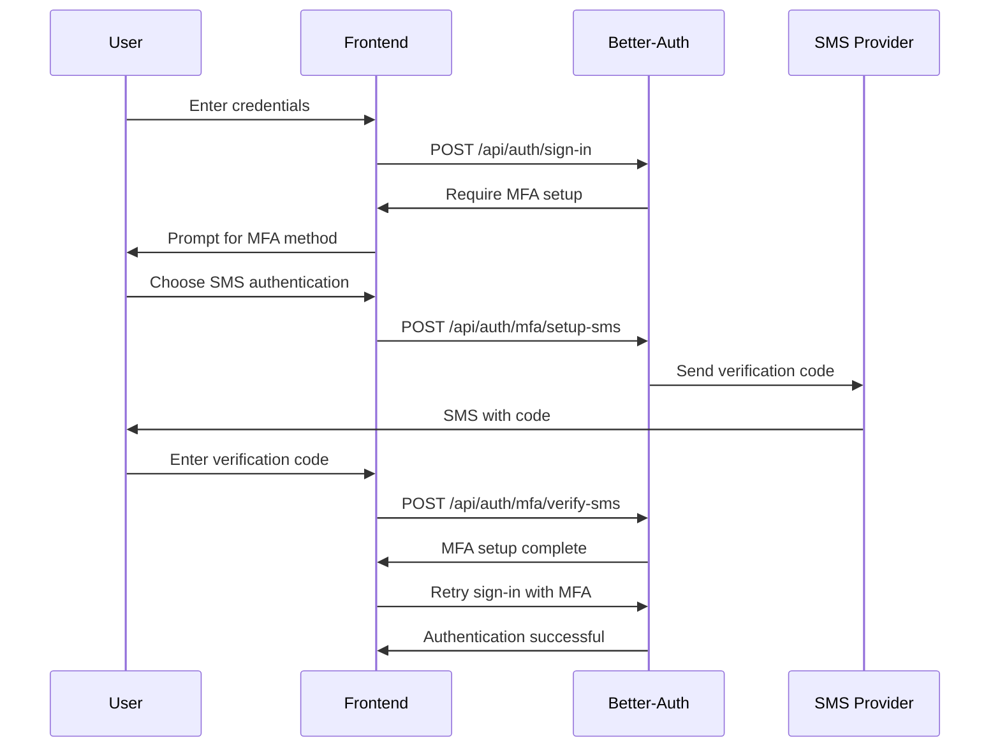

# Authentication & Authorization Strategy

## Better-Auth Implementation Overview

Better-Auth will be implemented as the central authentication system for the angel investing platform, providing secure user authentication, session management, and authorization capabilities.

## Architecture Overview

```
┌─────────────────┐    ┌─────────────────┐    ┌─────────────────┐
│   Frontend      │    │   Better-Auth   │    │   Database      │
│   (React)       │◄──►│   Server        │◄──►│   (PostgreSQL)  │
│                 │    │                 │    │                 │
│ - Login Forms   │    │ - Session Mgmt  │    │ - Users Table   │
│ - Route Guards  │    │ - JWT Tokens    │    │ - Sessions      │
│ - Auth State    │    │ - OAuth         │    │ - OAuth Accounts│
│ - Permissions   │    │ - Password Hash │    │                 │
└─────────────────┘    └─────────────────┘    └─────────────────┘
```

## Better-Auth Configuration

### Core Configuration (`auth.ts`)

```typescript
import { betterAuth } from "better-auth"
import { prismaAdapter } from "better-auth/adapters/prisma"
import { prisma } from "@/lib/prisma"
import { sendEmail } from "@/lib/email"

export const auth = betterAuth({
  database: prismaAdapter(prisma),
  secret: process.env.BETTER_AUTH_SECRET,
  baseURL: process.env.BETTER_AUTH_URL,

  // Email & Password Authentication
  emailAndPassword: {
    enabled: true,
    requireEmailVerification: true,
    sendResetPassword: async ({ user, url }) => {
      await sendEmail({
        to: user.email,
        subject: "Reset your password",
        html: `Click <a href="${url}">here</a> to reset your password`
      })
    }
  },

  // OAuth Providers
  socialProviders: {
    google: {
      clientId: process.env.GOOGLE_CLIENT_ID!,
      clientSecret: process.env.GOOGLE_CLIENT_SECRET!,
    },
    linkedin: {
      clientId: process.env.LINKEDIN_CLIENT_ID!,
      clientSecret: process.env.LINKEDIN_CLIENT_SECRET!,
    }
  },

  // Session Configuration
  session: {
    cookieCache: {
      enabled: true,
      maxAge: 5 * 60 // 5 minutes
    },
    expiresIn: 60 * 60 * 24 * 7, // 7 days
    updateAge: 60 * 60 * 24 // 24 hours
  },

  // Account Management
  account: {
    accountLinking: {
      enabled: true,
      trustedProviders: ["google", "linkedin"]
    }
  },

  // User Management
  user: {
    additionalFields: {
      role: {
        type: "select",
        options: ["FOUNDER", "INVESTOR", "SYNDICATE_LEAD", "ADMIN"],
        required: true
      },
      isVerified: {
        type: "boolean",
        defaultValue: false
      }
    }
  }
})
```

## Authentication Flows

### 1. User Registration Flow



**Registration Endpoint:**
```typescript
// POST /api/auth/sign-up
export async function POST(request: Request) {
  try {
    const { email, password, name, role } = await request.json()

    const user = await auth.api.signUpEmail({
      body: {
        email,
        password,
        name,
        role, // Custom field
        isVerified: false
      }
    })

    return Response.json({
      user: {
        id: user.id,
        email: user.email,
        name: user.name,
        role: user.role
      },
      requiresVerification: true
    })
  } catch (error) {
    return Response.json(
      { error: "Registration failed" },
      { status: 400 }
    )
  }
}
```

### 2. Email Verification Flow

```typescript
// GET /api/auth/verify-email
export async function GET(request: Request) {
  const { searchParams } = new URL(request.url)
  const token = searchParams.get("token")

  try {
    const user = await auth.api.verifyEmail({
      body: { token }
    })

    // Update user profile with verification status
    await prisma.user.update({
      where: { id: user.id },
      data: { isVerified: true }
    })

    return Response.redirect(`${process.env.FRONTEND_URL}/login?verified=true`)
  } catch (error) {
    return Response.redirect(`${process.env.FRONTEND_URL}/login?error=verification_failed`)
  }
}
```

### 3. Login Flow

```typescript
// POST /api/auth/sign-in
export async function POST(request: Request) {
  try {
    const { email, password } = await request.json()

    const user = await auth.api.signInEmail({
      body: { email, password }
    })

    // Check if user is verified
    if (!user.isVerified) {
      return Response.json(
        { error: "Please verify your email before signing in" },
        { status: 403 }
      )
    }

    return Response.json({
      user: {
        id: user.id,
        email: user.email,
        name: user.name,
        role: user.role
      },
      accessToken: user.accessToken,
      refreshToken: user.refreshToken
    })
  } catch (error) {
    return Response.json(
      { error: "Invalid credentials" },
      { status: 401 }
    )
  }
}
```

## Authorization Strategy

### Role-Based Access Control (RBAC)

#### User Roles and Permissions

```typescript
export const USER_ROLES = {
  FOUNDER: "FOUNDER",
  INVESTOR: "INVESTOR",
  SYNDICATE_LEAD: "SYNDICATE_LEAD",
  ADMIN: "ADMIN"
} as const

export const PERMISSIONS = {
  // Startup Management
  CREATE_STARTUP: ["FOUNDER"],
  EDIT_OWN_STARTUP: ["FOUNDER"],
  VIEW_ALL_STARTUPS: ["INVESTOR", "SYNDICATE_LEAD", "ADMIN"],

  // Pitch Management
  CREATE_PITCH: ["FOUNDER"],
  EDIT_OWN_PITCH: ["FOUNDER"],
  VIEW_PITCH: ["INVESTOR", "SYNDICATE_LEAD", "ADMIN"],
  APPROVE_PITCH: ["ADMIN"],

  // Investment Management
  MAKE_INVESTMENT: ["INVESTOR", "SYNDICATE_LEAD"],
  VIEW_OWN_INVESTMENTS: ["INVESTOR", "SYNDICATE_LEAD"],
  MANAGE_ALL_INVESTMENTS: ["ADMIN"],

  // User Management
  VIEW_PROFILES: ["FOUNDER", "INVESTOR", "SYNDICATE_LEAD", "ADMIN"],
  VERIFY_USERS: ["ADMIN"],
  MANAGE_USERS: ["ADMIN"]
} as const
```

#### Permission Checking Middleware

```typescript
// lib/auth-middleware.ts
import { auth } from "@/auth"
import { NextRequest } from "next/server"
import { PERMISSIONS, USER_ROLES } from "@/lib/permissions"

export async function requireAuth(request: NextRequest) {
  const session = await auth.api.getSession({
    headers: request.headers
  })

  if (!session) {
    return Response.json(
      { error: "Authentication required" },
      { status: 401 }
    )
  }

  return session
}

export async function requirePermission(
  request: NextRequest,
  permission: keyof typeof PERMISSIONS
) {
  const session = await requireAuth(request)

  if (!session?.user?.role) {
    return Response.json(
      { error: "User role not found" },
      { status: 403 }
    )
  }

  const userRole = session.user.role as keyof typeof USER_ROLES
  const allowedRoles = PERMISSIONS[permission]

  if (!allowedRoles.includes(userRole)) {
    return Response.json(
      { error: "Insufficient permissions" },
      { status: 403 }
    )
  }

  return session
}

export async function requireRole(
  request: NextRequest,
  roles: (keyof typeof USER_ROLES)[]
) {
  const session = await requireAuth(request)

  if (!session?.user?.role) {
    return Response.json(
      { error: "User role not found" },
      { status: 403 }
    )
  }

  const userRole = session.user.role as keyof typeof USER_ROLES

  if (!roles.includes(userRole)) {
    return Response.json(
      { error: "Insufficient role permissions" },
      { status: 403 }
    )
  }

  return session
}
```

### Frontend Route Protection

#### React Route Guards

```typescript
// components/auth-route-guard.tsx
import { useSession } from "@/hooks/use-session"
import { useRouter } from "next/navigation"
import { useEffect } from "react"
import { PERMISSIONS } from "@/lib/permissions"

interface AuthRouteGuardProps {
  children: React.ReactNode
  requiredPermission?: keyof typeof PERMISSIONS
  requiredRoles?: (keyof typeof USER_ROLES)[]
  fallbackPath?: string
}

export function AuthRouteGuard({
  children,
  requiredPermission,
  requiredRoles,
  fallbackPath = "/login"
}: AuthRouteGuardProps) {
  const { user, isLoading } = useSession()
  const router = useRouter()

  useEffect(() => {
    if (isLoading) return

    if (!user) {
      router.push(fallbackPath)
      return
    }

    if (requiredRoles && !requiredRoles.includes(user.role)) {
      router.push("/unauthorized")
      return
    }

    if (requiredPermission) {
      const allowedRoles = PERMISSIONS[requiredPermission]
      if (!allowedRoles.includes(user.role)) {
        router.push("/unauthorized")
        return
      }
    }
  }, [user, isLoading, requiredRoles, requiredPermission, router, fallbackPath])

  if (isLoading) {
    return <div>Loading...</div>
  }

  if (!user) {
    return null
  }

  if (requiredRoles && !requiredRoles.includes(user.role)) {
    return null
  }

  if (requiredPermission) {
    const allowedRoles = PERMISSIONS[requiredPermission]
    if (!allowedRoles.includes(user.role)) {
      return null
    }
  }

  return <>{children}</>
}
```

#### Zustand Auth Store

```typescript
// stores/auth-store.ts
import { create } from "zustand"
import { persist } from "zustand/middleware"

interface User {
  id: string
  email: string
  name: string
  role: "FOUNDER" | "INVESTOR" | "SYNDICATE_LEAD" | "ADMIN"
  isVerified: boolean
  avatar_url?: string
}

interface AuthState {
  user: User | null
  accessToken: string | null
  refreshToken: string | null
  isAuthenticated: boolean
  isLoading: boolean

  // Actions
  login: (user: User, accessToken: string, refreshToken: string) => void
  logout: () => void
  updateUser: (user: Partial<User>) => void
  setLoading: (loading: boolean) => void
}

export const useAuthStore = create<AuthState>()(
  persist(
    (set, get) => ({
      user: null,
      accessToken: null,
      refreshToken: null,
      isAuthenticated: false,
      isLoading: true,

      login: (user, accessToken, refreshToken) => {
        set({
          user,
          accessToken,
          refreshToken,
          isAuthenticated: true,
          isLoading: false
        })
      },

      logout: () => {
        set({
          user: null,
          accessToken: null,
          refreshToken: null,
          isAuthenticated: false,
          isLoading: false
        })
      },

      updateUser: (updatedUser) => {
        const currentUser = get().user
        if (currentUser) {
          set({
            user: { ...currentUser, ...updatedUser }
          })
        }
      },

      setLoading: (loading) => {
        set({ isLoading: loading })
      }
    }),
    {
      name: "auth-storage",
      partialize: (state) => ({
        user: state.user,
        accessToken: state.accessToken,
        refreshToken: state.refreshToken,
        isAuthenticated: state.isAuthenticated
      })
    }
  )
)
```

## Session Management

### Token Refresh Strategy

```typescript
// lib/auth-client.ts
class AuthClient {
  private refreshPromise: Promise<any> | null = null

  async getValidToken(): Promise<string> {
    const { accessToken, refreshToken } = useAuthStore.getState()

    if (!accessToken || !refreshToken) {
      throw new Error("No tokens available")
    }

    // Check if token is expired or expires soon (within 5 minutes)
    const tokenPayload = this.decodeToken(accessToken)
    const isExpired = tokenPayload.exp * 1000 < Date.now() + 5 * 60 * 1000

    if (!isExpired) {
      return accessToken
    }

    // Refresh token
    return this.refreshAccessToken(refreshToken)
  }

  private async refreshAccessToken(refreshToken: string): Promise<string> {
    // Prevent multiple simultaneous refresh requests
    if (this.refreshPromise) {
      return this.refreshPromise
    }

    this.refreshPromise = fetch("/api/auth/refresh", {
      method: "POST",
      headers: {
        "Content-Type": "application/json"
      },
      body: JSON.stringify({ refreshToken })
    })
      .then(async (response) => {
        if (!response.ok) {
          throw new Error("Token refresh failed")
        }

        const data = await response.json()

        // Update stored tokens
        useAuthStore.getState().login(
          data.user,
          data.accessToken,
          data.refreshToken
        )

        return data.accessToken
      })
      .finally(() => {
        this.refreshPromise = null
      })

    return this.refreshPromise
  }

  private decodeToken(token: string): any {
    try {
      return JSON.parse(atob(token.split(".")[1]))
    } catch {
      return {}
    }
  }
}
```

### API Request Interceptor

```typescript
// lib/api-client.ts
import { authClient } from "./auth-client"

class ApiClient {
  async request(endpoint: string, options: RequestInit = {}): Promise<Response> {
    const token = await authClient.getValidToken()

    const response = await fetch(`/api${endpoint}`, {
      ...options,
      headers: {
        ...options.headers,
        Authorization: `Bearer ${token}`,
        "Content-Type": "application/json"
      }
    })

    if (response.status === 401) {
      // Token might be invalid, logout user
      useAuthStore.getState().logout()
      window.location.href = "/login"
      throw new Error("Unauthorized")
    }

    return response
  }
}
```

## Security Considerations

### Password Security
- Bcrypt hashing with salt rounds >= 12
- Password complexity requirements
- Rate limiting on login attempts
- Account lockout after failed attempts

### Session Security
- Secure HTTP-only cookies
- Session timeout handling
- CSRF protection
- XSS prevention

### Data Protection
- Input sanitization and validation
- SQL injection prevention via Prisma
- Sensitive data encryption at rest
- Secure headers (HSTS, CSP, etc.)

### OAuth Security
- State parameter validation
- Secure redirect URI configuration
- Token storage in HTTP-only cookies
- Provider whitelisting

## Multi-Factor Authentication (MFA)

### Implementation Strategy

```typescript
// Extend Better-Auth configuration for MFA
export const auth = betterAuth({
  // ... existing config
  multiFactor: {
    enabled: true,
    totp: {
      enabled: true
    },
    sms: {
      enabled: true,
      sendSMS: async (phoneNumber, code) => {
        // Send SMS via provider (Twilio, AWS SNS, etc.)
      }
    }
  }
})
```

### MFA Flow



## Account Recovery

### Password Reset Flow

```typescript
// POST /api/auth/forgot-password
export async function POST(request: Request) {
  try {
    const { email } = await request.json()

    await auth.api.forgetPassword({
      body: { email }
    })

    return Response.json({
      message: "Password reset email sent"
    })
  } catch (error) {
    return Response.json(
      { error: "Failed to send reset email" },
      { status: 400 }
    )
  }
}
```

## Integration with Frontend

### React Hook for Authentication

```typescript
// hooks/use-auth.ts
import { useAuthStore } from "@/stores/auth-store"
import { useEffect } from "react"

export function useAuth() {
  const {
    user,
    accessToken,
    isAuthenticated,
    isLoading,
    login,
    logout,
    updateUser
  } = useAuthStore()

  useEffect(() => {
    // Initialize auth state on app load
    const initAuth = async () => {
      try {
        const response = await fetch("/api/auth/session")
        if (response.ok) {
          const { user, accessToken, refreshToken } = await response.json()
          login(user, accessToken, refreshToken)
        } else {
          logout()
        }
      } catch (error) {
        logout()
      }
    }

    initAuth()
  }, [login, logout])

  return {
    user,
    accessToken,
    isAuthenticated,
    isLoading,
    login,
    logout,
    updateUser
  }
}
```

This authentication and authorization strategy provides a comprehensive, secure foundation for the angel investing platform, supporting multiple user roles, secure session management, and scalable permission systems.