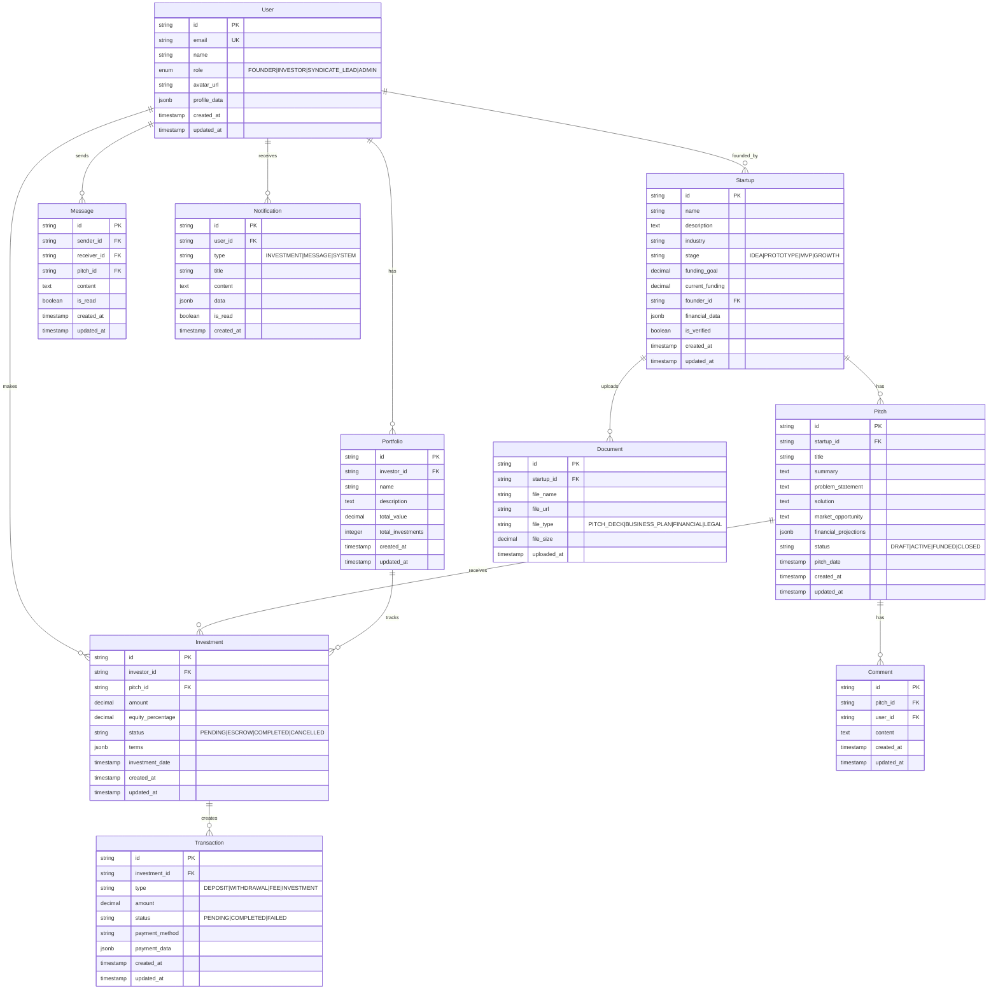

# Database Schema Design

## Entity Relationship Diagram (ERD)



## Detailed Table Specifications

### Core User Management

#### Users Table
```sql
CREATE TABLE users (
    id VARCHAR(36) PRIMARY KEY DEFAULT (UUID()),
    email VARCHAR(255) UNIQUE NOT NULL,
    name VARCHAR(255) NOT NULL,
    role ENUM('FOUNDER', 'INVESTOR', 'SYNDICATE_LEAD', 'ADMIN') NOT NULL,
    avatar_url TEXT,
    profile_data JSONB,
    is_verified BOOLEAN DEFAULT FALSE,
    created_at TIMESTAMP DEFAULT CURRENT_TIMESTAMP,
    updated_at TIMESTAMP DEFAULT CURRENT_TIMESTAMP ON UPDATE CURRENT_TIMESTAMP,

    INDEX idx_users_email (email),
    INDEX idx_users_role (role),
    INDEX idx_users_created_at (created_at)
);
```

#### User Profiles Table (Extended Information)
```sql
CREATE TABLE user_profiles (
    id VARCHAR(36) PRIMARY KEY DEFAULT (UUID()),
    user_id VARCHAR(36) NOT NULL,
    bio TEXT,
    location VARCHAR(255),
    linkedin_url TEXT,
    twitter_url TEXT,
    website_url TEXT,
    investment_range_min DECIMAL(15,2),
    investment_range_max DECIMAL(15,2),
    preferred_industries JSONB,
    previous_exits JSONB,
    accreditation_status ENUM('PENDING', 'VERIFIED', 'REJECTED'),
    kyc_status ENUM('PENDING', 'VERIFIED', 'REJECTED'),
    created_at TIMESTAMP DEFAULT CURRENT_TIMESTAMP,
    updated_at TIMESTAMP DEFAULT CURRENT_TIMESTAMP ON UPDATE CURRENT_TIMESTAMP,

    FOREIGN KEY (user_id) REFERENCES users(id) ON DELETE CASCADE,
    INDEX idx_user_profiles_user_id (user_id),
    INDEX idx_user_profiles_accreditation (accreditation_status)
);
```

### Startup Management

#### Startups Table
```sql
CREATE TABLE startups (
    id VARCHAR(36) PRIMARY KEY DEFAULT (UUID()),
    name VARCHAR(255) NOT NULL,
    slug VARCHAR(255) UNIQUE NOT NULL,
    description TEXT,
    industry VARCHAR(100),
    stage ENUM('IDEA', 'PROTOTYPE', 'MVP', 'GROWTH', 'SCALE') NOT NULL,
    funding_goal DECIMAL(15,2) NOT NULL,
    current_funding DECIMAL(15,2) DEFAULT 0,
    founder_id VARCHAR(36) NOT NULL,
    website_url TEXT,
    logo_url TEXT,
    team_size INTEGER,
    founded_date DATE,
    business_model TEXT,
    target_market TEXT,
    competitive_advantage TEXT,
    financial_data JSONB,
    is_verified BOOLEAN DEFAULT FALSE,
    is_active BOOLEAN DEFAULT TRUE,
    created_at TIMESTAMP DEFAULT CURRENT_TIMESTAMP,
    updated_at TIMESTAMP DEFAULT CURRENT_TIMESTAMP ON UPDATE CURRENT_TIMESTAMP,

    FOREIGN KEY (founder_id) REFERENCES users(id),
    INDEX idx_startups_founder (founder_id),
    INDEX idx_startups_industry (industry),
    INDEX idx_startups_stage (stage),
    INDEX idx_startups_slug (slug)
);
```

### Investment Management

#### Pitches Table
```sql
CREATE TABLE pitches (
    id VARCHAR(36) PRIMARY KEY DEFAULT (UUID()),
    startup_id VARCHAR(36) NOT NULL,
    title VARCHAR(255) NOT NULL,
    slug VARCHAR(255) UNIQUE NOT NULL,
    summary TEXT,
    problem_statement TEXT,
    solution TEXT,
    market_opportunity TEXT,
    competitive_analysis TEXT,
    financial_projections JSONB,
    funding_amount DECIMAL(15,2) NOT NULL,
    equity_offered DECIMAL(5,2),
    minimum_investment DECIMAL(15,2),
    status ENUM('DRAFT', 'UNDER_REVIEW', 'ACTIVE', 'FUNDED', 'CLOSED', 'WITHDRAWN') DEFAULT 'DRAFT',
    pitch_deck_url TEXT,
    video_url TEXT,
    tags JSONB,
    view_count INTEGER DEFAULT 0,
    is_featured BOOLEAN DEFAULT FALSE,
    expires_at TIMESTAMP,
    created_at TIMESTAMP DEFAULT CURRENT_TIMESTAMP,
    updated_at TIMESTAMP DEFAULT CURRENT_TIMESTAMP ON UPDATE CURRENT_TIMESTAMP,

    FOREIGN KEY (startup_id) REFERENCES startups(id) ON DELETE CASCADE,
    INDEX idx_pitches_startup (startup_id),
    INDEX idx_pitches_status (status),
    INDEX idx_pitches_featured (is_featured),
    INDEX idx_pitches_expires (expires_at)
);
```

#### Investments Table
```sql
CREATE TABLE investments (
    id VARCHAR(36) PRIMARY KEY DEFAULT (UUID()),
    investor_id VARCHAR(36) NOT NULL,
    pitch_id VARCHAR(36) NOT NULL,
    amount DECIMAL(15,2) NOT NULL,
    equity_percentage DECIMAL(5,2),
    share_price DECIMAL(15,2),
    status ENUM('PENDING', 'ESCROW', 'DUE_DILIGENCE', 'LEGAL_REVIEW', 'COMPLETED', 'CANCELLED') DEFAULT 'PENDING',
    investment_type ENUM('DIRECT', 'SYNDICATE') DEFAULT 'DIRECT',
    syndicate_lead_id VARCHAR(36),
    terms JSONB,
    legal_documents JSONB,
    escrow_reference VARCHAR(255),
    payment_method VARCHAR(50),
    payment_reference VARCHAR(255),
    investment_date TIMESTAMP,
    created_at TIMESTAMP DEFAULT CURRENT_TIMESTAMP,
    updated_at TIMESTAMP DEFAULT CURRENT_TIMESTAMP ON UPDATE CURRENT_TIMESTAMP,

    FOREIGN KEY (investor_id) REFERENCES users(id),
    FOREIGN KEY (pitch_id) REFERENCES pitches(id) ON DELETE CASCADE,
    FOREIGN KEY (syndicate_lead_id) REFERENCES users(id),
    INDEX idx_investments_investor (investor_id),
    INDEX idx_investments_pitch (pitch_id),
    INDEX idx_investments_status (status),
    INDEX idx_investments_type (investment_type)
);
```

### Portfolio Management

#### Portfolios Table
```sql
CREATE TABLE portfolios (
    id VARCHAR(36) PRIMARY KEY DEFAULT (UUID()),
    investor_id VARCHAR(36) NOT NULL,
    name VARCHAR(255) NOT NULL,
    description TEXT,
    is_public BOOLEAN DEFAULT FALSE,
    total_invested DECIMAL(15,2) DEFAULT 0,
    total_value DECIMAL(15,2) DEFAULT 0,
    total_exits DECIMAL(15,2) DEFAULT 0,
    investment_count INTEGER DEFAULT 0,
    created_at TIMESTAMP DEFAULT CURRENT_TIMESTAMP,
    updated_at TIMESTAMP DEFAULT CURRENT_TIMESTAMP ON UPDATE CURRENT_TIMESTAMP,

    FOREIGN KEY (investor_id) REFERENCES users(id) ON DELETE CASCADE,
    INDEX idx_portfolios_investor (investor_id),
    INDEX idx_portfolios_public (is_public)
);
```

### Financial Management

#### Transactions Table
```sql
CREATE TABLE transactions (
    id VARCHAR(36) PRIMARY KEY DEFAULT (UUID()),
    investment_id VARCHAR(36),
    user_id VARCHAR(36) NOT NULL,
    type ENUM('DEPOSIT', 'WITHDRAWAL', 'FEE', 'INVESTMENT', 'REFUND') NOT NULL,
    amount DECIMAL(15,2) NOT NULL,
    currency VARCHAR(3) DEFAULT 'USD',
    status ENUM('PENDING', 'PROCESSING', 'COMPLETED', 'FAILED', 'CANCELLED') DEFAULT 'PENDING',
    payment_method VARCHAR(50),
    payment_provider VARCHAR(50),
    payment_reference VARCHAR(255),
    external_transaction_id VARCHAR(255),
    fee_amount DECIMAL(15,2) DEFAULT 0,
    net_amount DECIMAL(15,2) NOT NULL,
    description TEXT,
    metadata JSONB,
    processed_at TIMESTAMP,
    created_at TIMESTAMP DEFAULT CURRENT_TIMESTAMP,
    updated_at TIMESTAMP DEFAULT CURRENT_TIMESTAMP ON UPDATE CURRENT_TIMESTAMP,

    FOREIGN KEY (investment_id) REFERENCES investments(id) ON DELETE SET NULL,
    FOREIGN KEY (user_id) REFERENCES users(id),
    INDEX idx_transactions_user (user_id),
    INDEX idx_transactions_investment (investment_id),
    INDEX idx_transactions_type (type),
    INDEX idx_transactions_status (status),
    INDEX idx_transactions_external (external_transaction_id)
);
```

### Communication System

#### Messages Table
```sql
CREATE TABLE messages (
    id VARCHAR(36) PRIMARY KEY DEFAULT (UUID()),
    sender_id VARCHAR(36) NOT NULL,
    receiver_id VARCHAR(36) NOT NULL,
    pitch_id VARCHAR(36),
    investment_id VARCHAR(36),
    subject VARCHAR(255),
    content TEXT NOT NULL,
    message_type ENUM('GENERAL', 'PITCH_INQUIRY', 'INVESTMENT_DISCUSSION', 'SUPPORT') DEFAULT 'GENERAL',
    is_read BOOLEAN DEFAULT FALSE,
    read_at TIMESTAMP,
    created_at TIMESTAMP DEFAULT CURRENT_TIMESTAMP,
    updated_at TIMESTAMP DEFAULT CURRENT_TIMESTAMP ON UPDATE CURRENT_TIMESTAMP,

    FOREIGN KEY (sender_id) REFERENCES users(id),
    FOREIGN KEY (receiver_id) REFERENCES users(id),
    FOREIGN KEY (pitch_id) REFERENCES pitches(id) ON DELETE CASCADE,
    FOREIGN KEY (investment_id) REFERENCES investments(id) ON DELETE CASCADE,
    INDEX idx_messages_sender (sender_id),
    INDEX idx_messages_receiver (receiver_id),
    INDEX idx_messages_conversation (sender_id, receiver_id),
    INDEX idx_messages_pitch (pitch_id),
    INDEX idx_messages_unread (is_read)
);
```

#### Comments Table
```sql
CREATE TABLE comments (
    id VARCHAR(36) PRIMARY KEY DEFAULT (UUID()),
    pitch_id VARCHAR(36) NOT NULL,
    user_id VARCHAR(36) NOT NULL,
    parent_comment_id VARCHAR(36),
    content TEXT NOT NULL,
    is_approved BOOLEAN DEFAULT TRUE,
    likes_count INTEGER DEFAULT 0,
    created_at TIMESTAMP DEFAULT CURRENT_TIMESTAMP,
    updated_at TIMESTAMP DEFAULT CURRENT_TIMESTAMP ON UPDATE CURRENT_TIMESTAMP,

    FOREIGN KEY (pitch_id) REFERENCES pitches(id) ON DELETE CASCADE,
    FOREIGN KEY (user_id) REFERENCES users(id),
    FOREIGN KEY (parent_comment_id) REFERENCES comments(id) ON DELETE CASCADE,
    INDEX idx_comments_pitch (pitch_id),
    INDEX idx_comments_user (user_id),
    INDEX idx_comments_parent (parent_comment_id)
);
```

### Document Management

#### Documents Table
```sql
CREATE TABLE documents (
    id VARCHAR(36) PRIMARY KEY DEFAULT (UUID()),
    startup_id VARCHAR(36) NOT NULL,
    pitch_id VARCHAR(36),
    name VARCHAR(255) NOT NULL,
    file_path TEXT NOT NULL,
    file_url TEXT NOT NULL,
    file_type ENUM('PITCH_DECK', 'BUSINESS_PLAN', 'FINANCIAL_STATEMENT', 'LEGAL_DOCUMENT', 'OTHER') NOT NULL,
    file_size INTEGER NOT NULL,
    mime_type VARCHAR(100),
    is_public BOOLEAN DEFAULT FALSE,
    download_count INTEGER DEFAULT 0,
    uploaded_by VARCHAR(36) NOT NULL,
    created_at TIMESTAMP DEFAULT CURRENT_TIMESTAMP,
    updated_at TIMESTAMP DEFAULT CURRENT_TIMESTAMP ON UPDATE CURRENT_TIMESTAMP,

    FOREIGN KEY (startup_id) REFERENCES startups(id) ON DELETE CASCADE,
    FOREIGN KEY (pitch_id) REFERENCES pitches(id) ON DELETE CASCADE,
    FOREIGN KEY (uploaded_by) REFERENCES users(id),
    INDEX idx_documents_startup (startup_id),
    INDEX idx_documents_pitch (pitch_id),
    INDEX idx_documents_type (file_type),
    INDEX idx_documents_public (is_public)
);
```

### Notification System

#### Notifications Table
```sql
CREATE TABLE notifications (
    id VARCHAR(36) PRIMARY KEY DEFAULT (UUID()),
    user_id VARCHAR(36) NOT NULL,
    type ENUM('INVESTMENT_UPDATE', 'MESSAGE', 'PITCH_UPDATE', 'SYSTEM', 'PAYMENT') NOT NULL,
    title VARCHAR(255) NOT NULL,
    content TEXT NOT NULL,
    data JSONB,
    is_read BOOLEAN DEFAULT FALSE,
    read_at TIMESTAMP,
    action_url TEXT,
    priority ENUM('LOW', 'MEDIUM', 'HIGH') DEFAULT 'MEDIUM',
    expires_at TIMESTAMP,
    created_at TIMESTAMP DEFAULT CURRENT_TIMESTAMP,
    updated_at TIMESTAMP DEFAULT CURRENT_TIMESTAMP ON UPDATE CURRENT_TIMESTAMP,

    FOREIGN KEY (user_id) REFERENCES users(id) ON DELETE CASCADE,
    INDEX idx_notifications_user (user_id),
    INDEX idx_notifications_unread (is_read),
    INDEX idx_notifications_type (type),
    INDEX idx_notifications_created (created_at)
);
```

## Database Constraints and Indexes

### Performance Optimizations
- Composite indexes for common query patterns
- Partial indexes for active records
- Covering indexes for frequently accessed columns

### Data Integrity
- Foreign key constraints with CASCADE/SET NULL as appropriate
- Check constraints for business logic validation
- Unique constraints for business keys

### Partitioning Strategy
- Time-based partitioning for transactions and notifications tables
- Consider user-based partitioning for large-scale growth

## Migration Strategy

### Initial Schema
1. Create users and core authentication tables
2. Add user profiles and extended information
3. Create startup and pitch management tables
4. Implement investment and portfolio tracking
5. Add communication and notification systems
6. Create document management tables

### Version Management
- Use Prisma migrations for schema versioning
- Semantic versioning for database changes
- Rollback capabilities for production deployments