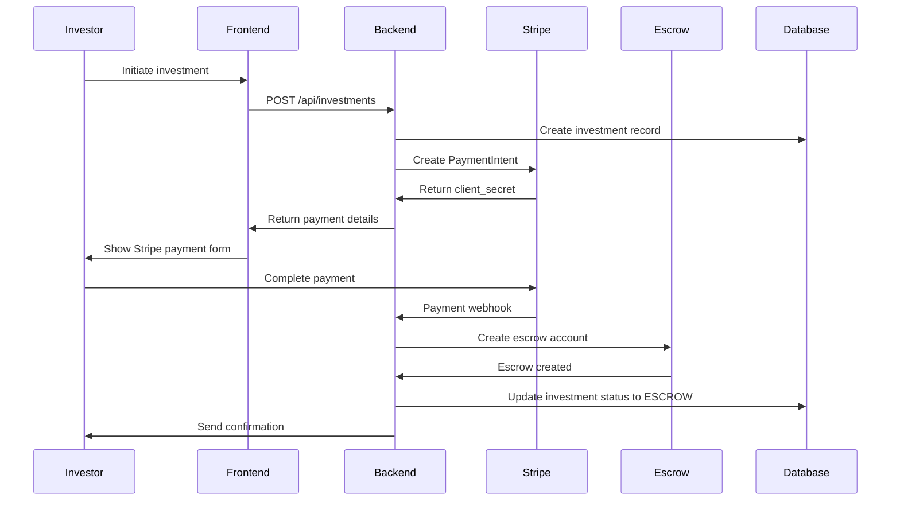

# Payment Integration Strategy with Escrow Model

## Overview

The angel investing platform requires a robust payment system supporting direct investments with escrow functionality, ensuring secure fund handling between investors and startups while maintaining regulatory compliance.

## Payment Architecture

```
┌─────────────────────────────────────────────────────────────────┐
│                        CLIENT                                   │
├─────────────────────────────────────────────────────────────────┤
│  ┌─────────────┐  ┌─────────────┐  ┌─────────────┐              │
│  │  Payment    │  │  Stripe     │  │  Wallet     │              │
│  │  Forms      │  │  Elements   │  │  Balance    │              │
│  │             │  │             │  │  Display    │              │
│  └─────────────┘  └─────────────┘  └─────────────┘              │
└─────────────────┬───────────────────────────────────────────────┘
                  │ HTTPS/PCI
                  ▼
┌─────────────────────────────────────────────────────────────────┐
│                      PAYMENT GATEWAY                             │
├─────────────────────────────────────────────────────────────────┤
│  ┌─────────────┐  ┌─────────────┐  ┌─────────────┐              │
│  │   Stripe    │  │  Plaid      │  │  Crypto     │              │
│  │   Payment   │  │   Bank      │  │   Payment   │              │
│  │  Processing │  │  Integration│  │  Processing │              │
│  └─────────────┘  └─────────────┘  └─────────────┘              │
└─────────────────┬───────────────────────────────────────────────┘
                  │
         ┌────────▼────────┐
         │   ESCROW        │
         │   SMART         │
         │  CONTRACTS      │
         └─────────────────┘
                  │
         ┌────────▼────────┐
         │   BANKING       │
         │   PARTNERS      │
         └─────────────────┘
```

## Escrow Implementation Strategy

### Smart Contract Architecture

```solidity
// contracts/Escrow.sol
pragma solidity ^0.8.19;

contract InvestmentEscrow {
    struct Escrow {
        address investor;
        address startup;
        uint256 amount;
        uint256 fee;
        uint256 releaseTime;
        bool isReleased;
        bool isRefunded;
    }

    mapping(bytes32 => Escrow) public escrows;
    address public platformWallet;

    event EscrowCreated(bytes32 indexed escrowId, address investor, address startup, uint256 amount);
    event FundsReleased(bytes32 indexed escrowId, address startup, uint256 amount);
    event FundsRefunded(bytes32 indexed escrowId, address investor, uint256 amount);

    constructor(address _platformWallet) {
        platformWallet = _platformWallet;
    }

    function createEscrow(
        bytes32 escrowId,
        address startup,
        uint256 amount,
        uint256 fee
    ) external payable {
        require(msg.value == amount + fee, "Incorrect amount sent");
        require(escrows[escrowId].investor == address(0), "Escrow already exists");

        escrows[escrowId] = Escrow({
            investor: msg.sender,
            startup: startup,
            amount: amount,
            fee: fee,
            releaseTime: block.timestamp + 30 days, // 30-day escrow period
            isReleased: false,
            isRefunded: false
        });

        emit EscrowCreated(escrowId, msg.sender, startup, amount);
    }

    function releaseFunds(bytes32 escrowId) external {
        Escrow storage escrow = escrows[escrowId];
        require(block.timestamp >= escrow.releaseTime, "Escrow period not ended");
        require(!escrow.isReleased && !escrow.isRefunded, "Funds already moved");

        escrow.isReleased = true;

        // Transfer funds to startup (minus platform fee)
        payable(escrow.startup).transfer(escrow.amount);

        // Transfer platform fee
        payable(platformWallet).transfer(escrow.fee);

        emit FundsReleased(escrowId, escrow.startup, escrow.amount);
    }

    function refundFunds(bytes32 escrowId) external {
        Escrow storage escrow = escrows[escrowId];
        require(msg.sender == escrow.investor || block.timestamp >= escrow.releaseTime + 90 days, "Not authorized");
        require(!escrow.isReleased && !escrow.isRefunded, "Funds already moved");

        escrow.isRefunded = true;

        // Refund full amount to investor
        payable(escrow.investor).transfer(escrow.amount + escrow.fee);

        emit FundsRefunded(escrowId, escrow.investor, escrow.amount + escrow.fee);
    }
}
```

### Traditional Escrow Service Integration

```typescript
// lib/escrow-service.ts
import { escrowProvider } from '@/lib/escrow-provider'

export class EscrowService {
  static async createEscrow(investmentId: string, amount: number, investorId: string, startupId: string) {
    // Generate unique escrow reference
    const escrowReference = `escrow_${investmentId}_${Date.now()}`

    // Create escrow account
    const escrowAccount = await escrowProvider.createAccount({
      reference: escrowReference,
      amount: amount,
      currency: 'USD',
      investor_id: investorId,
      startup_id: startupId,
      hold_period_days: 30
    })

    // Update investment record
    await prisma.investment.update({
      where: { id: investmentId },
      data: {
        escrow_reference: escrowReference,
        status: 'ESCROW'
      }
    })

    return {
      escrowId: escrowAccount.id,
      reference: escrowReference,
      accountDetails: escrowAccount.account_details
    }
  }

  static async releaseEscrow(escrowReference: string) {
    // Verify escrow conditions
    const investment = await prisma.investment.findFirst({
      where: { escrow_reference: escrowReference }
    })

    if (!investment) {
      throw new Error('Investment not found')
    }

    // Check if escrow period has passed
    const escrowAge = Date.now() - investment.created_at.getTime()
    const escrowPeriod = 30 * 24 * 60 * 60 * 1000 // 30 days

    if (escrowAge < escrowPeriod) {
      throw new Error('Escrow period has not ended')
    }

    // Release funds
    const result = await escrowProvider.releaseFunds(escrowReference)

    // Update investment status
    await prisma.investment.update({
      where: { id: investment.id },
      data: { status: 'COMPLETED' }
    })

    return result
  }

  static async refundEscrow(escrowReference: string, reason: string) {
    // Process refund
    const result = await escrowProvider.refundFunds(escrowReference, reason)

    // Update investment status
    const investment = await prisma.investment.findFirst({
      where: { escrow_reference: escrowReference }
    })

    if (investment) {
      await prisma.investment.update({
        where: { id: investment.id },
        data: { status: 'CANCELLED' }
      })
    }

    return result
  }
}
```

## Payment Provider Integration

### Stripe Integration

```typescript
// lib/payment-providers/stripe.ts
import Stripe from 'stripe'

const stripe = new Stripe(process.env.STRIPE_SECRET_KEY!, {
  apiVersion: '2023-10-16',
})

export class StripePaymentProvider {
  static async createPaymentIntent(investmentId: string, amount: number, currency: string) {
    const paymentIntent = await stripe.paymentIntents.create({
      amount: amount * 100, // Convert to cents
      currency: currency.toLowerCase(),
      metadata: {
        investment_id: investmentId,
        type: 'investment'
      },
      automatic_payment_methods: {
        enabled: true,
      },
    })

    return {
      clientSecret: paymentIntent.client_secret,
      paymentIntentId: paymentIntent.id,
      amount: paymentIntent.amount,
      currency: paymentIntent.currency
    }
  }

  static async confirmPayment(paymentIntentId: string) {
    const paymentIntent = await stripe.paymentIntents.retrieve(paymentIntentId)

    if (paymentIntent.status === 'succeeded') {
      return {
        success: true,
        transactionId: paymentIntent.id,
        amount: paymentIntent.amount_received,
        currency: paymentIntent.currency,
        status: 'completed'
      }
    }

    return {
      success: false,
      status: paymentIntent.status,
      error: 'Payment not completed'
    }
  }

  static async processRefund(paymentIntentId: string, amount?: number) {
    const refund = await stripe.refunds.create({
      payment_intent: paymentIntentId,
      amount: amount ? amount * 100 : undefined // Partial or full refund
    })

    return {
      refundId: refund.id,
      amount: refund.amount,
      status: refund.status
    }
  }
}
```

### Bank Transfer Integration (Plaid)

```typescript
// lib/payment-providers/plaid.ts
import { PlaidApi, Products, CountryCode } from 'plaid'

const plaidClient = new PlaidApi({
  basePath: PlaidApi.environments[process.env.PLAID_ENV!],
  configuration: {
    baseOptions: {
      headers: {
        'PLAID-CLIENT-ID': process.env.PLAID_CLIENT_ID,
        'PLAID-SECRET': process.env.PLAID_SECRET,
      },
    },
  },
})

export class PlaidPaymentProvider {
  static async createLinkToken(userId: string) {
    const linkTokenResponse = await plaidClient.linkTokenCreate({
      user: { client_user_id: userId },
      client_name: 'Angel Investing Platform',
      products: [Products.Auth, Products.Transactions],
      country_codes: [CountryCode.Us],
      language: 'en',
    })

    return linkTokenResponse.data.link_token
  }

  static async exchangePublicToken(publicToken: string) {
    const exchangeResponse = await plaidClient.itemPublicTokenExchange({
      public_token: publicToken,
    })

    return {
      accessToken: exchangeResponse.data.access_token,
      itemId: exchangeResponse.data.item_id
    }
  }

  static async getAccountBalance(accessToken: string) {
    const balanceResponse = await plaidClient.accountsBalanceGet({
      access_token: accessToken,
    })

    return balanceResponse.data.accounts.map(account => ({
      accountId: account.account_id,
      name: account.name,
      type: account.type,
      balance: account.balances.available,
      currency: account.balances.iso_currency_code
    }))
  }

  static async initiateTransfer(accessToken: string, accountId: string, amount: number, description: string) {
    // Create transfer recipient (escrow account)
    const transferResponse = await plaidClient.transferCreate({
      access_token: accessToken,
      account_id: accountId,
      type: 'credit',
      amount: amount.toString(),
      description,
      metadata: {
        type: 'investment_escrow'
      }
    })

    return {
      transferId: transferResponse.data.transfer_id,
      status: transferResponse.data.status
    }
  }
}
```

## Payment Flow Implementation

### Investment Payment Flow



### Payment Processing Controller

```typescript
// controllers/payment.controller.ts
import { NextRequest } from 'next/server'
import { auth } from '@/auth'
import { StripePaymentProvider } from '@/lib/payment-providers/stripe'
import { EscrowService } from '@/lib/escrow-service'
import { paymentQueue } from '@/lib/queue'

export async function POST(request: NextRequest) {
  try {
    const session = await auth.api.getSession({
      headers: request.headers
    })

    if (!session?.user) {
      return Response.json({ error: 'Unauthorized' }, { status: 401 })
    }

    const { investment_id, amount, payment_method } = await request.json()

    // Create investment record
    const investment = await prisma.investment.create({
      data: {
        investor_id: session.user.id,
        pitch_id: request.nextUrl.searchParams.get('pitch_id')!,
        amount: amount,
        status: 'PENDING',
        payment_method: payment_method
      }
    })

    // Process payment based on method
    if (payment_method === 'CARD') {
      const paymentIntent = await StripePaymentProvider.createPaymentIntent(
        investment.id,
        amount,
        'USD'
      )

      return Response.json({
        payment_intent: paymentIntent,
        investment_id: investment.id
      })
    }

    if (payment_method === 'BANK_TRANSFER') {
      // Add to payment queue for processing
      await paymentQueue.add('process_bank_transfer', {
        investmentId: investment.id,
        amount: amount,
        investorId: session.user.id
      })

      return Response.json({
        investment_id: investment.id,
        status: 'PROCESSING',
        message: 'Bank transfer initiated'
      })
    }

  } catch (error) {
    console.error('Payment creation failed:', error)
    return Response.json(
      { error: 'Payment creation failed' },
      { status: 500 }
    )
  }
}
```

## Fee Structure and Calculation

### Platform Fee Model

```typescript
// lib/fee-calculator.ts
export class FeeCalculator {
  static calculatePlatformFee(amount: number, investmentType: 'DIRECT' | 'SYNDICATE'): number {
    if (investmentType === 'SYNDICATE') {
      // 3% for syndicate investments
      return amount * 0.03
    }

    // 5% for direct investments
    return amount * 0.05
  }

  static calculateCarryFee(amount: number, performanceMultiple: number): number {
    if (performanceMultiple <= 1) return 0

    // 20% carry on profits
    const profit = (performanceMultiple - 1) * amount
    return profit * 0.20
  }

  static calculateTotalFees(amount: number, investmentType: string, performanceMultiple?: number): {
    platformFee: number
    carryFee: number
    totalFee: number
    netAmount: number
  } {
    const platformFee = this.calculatePlatformFee(amount, investmentType as 'DIRECT' | 'SYNDICATE')
    const carryFee = performanceMultiple ? this.calculateCarryFee(amount, performanceMultiple) : 0

    const totalFee = platformFee + carryFee
    const netAmount = amount - totalFee

    return {
      platformFee,
      carryFee,
      totalFee,
      netAmount
    }
  }
}
```

### Fee Distribution

```typescript
// lib/fee-distribution.ts
export class FeeDistributionService {
  static async distributePlatformFee(investmentId: string) {
    const investment = await prisma.investment.findUnique({
      where: { id: investmentId },
      include: { pitch: { include: { startup: true } } }
    })

    if (!investment) return

    const fees = FeeCalculator.calculateTotalFees(
      investment.amount,
      investment.investment_type || 'DIRECT'
    )

    // Create fee distribution records
    await prisma.transaction.createMany({
      data: [
        {
          investment_id: investmentId,
          user_id: investment.investor_id,
          type: 'FEE',
          amount: fees.platformFee,
          description: 'Platform fee',
          status: 'COMPLETED'
        },
        {
          investment_id: investmentId,
          user_id: investment.pitch.startup.founder_id,
          type: 'INVESTMENT',
          amount: fees.netAmount,
          description: 'Investment amount (net of fees)',
          status: 'COMPLETED'
        }
      ]
    })

    // Update platform revenue
    await prisma.platform_revenue.create({
      data: {
        investment_id: investmentId,
        amount: fees.platformFee,
        type: 'PLATFORM_FEE',
        description: `Platform fee for investment ${investmentId}`
      }
    })
  }
}
```

## Security and Compliance

### PCI Compliance

```typescript
// lib/security/pci-compliance.ts
export class PCIComplianceService {
  static sanitizePaymentData(paymentData: any) {
    // Remove sensitive card data from logs
    const sanitized = { ...paymentData }
    delete sanitized.card_number
    delete sanitized.cvv
    delete sanitized.expiry_date

    return sanitized
  }

  static validatePaymentData(paymentData: any) {
    // Validate required fields without storing sensitive data
    const requiredFields = ['amount', 'currency', 'payment_method']
    const missingFields = requiredFields.filter(field => !paymentData[field])

    if (missingFields.length > 0) {
      throw new Error(`Missing required fields: ${missingFields.join(', ')}`)
    }

    // Validate amount
    if (paymentData.amount <= 0) {
      throw new Error('Amount must be greater than 0')
    }

    // Validate currency
    const validCurrencies = ['USD', 'EUR', 'GBP']
    if (!validCurrencies.includes(paymentData.currency)) {
      throw new Error('Invalid currency')
    }
  }
}
```

### AML/KYC Integration

```typescript
// lib/compliance/aml-kyc.ts
import { kycProvider } from '@/lib/kyc-provider'

export class AMLKYCService {
  static async verifyInvestorIdentity(userId: string, investmentAmount: number) {
    const user = await prisma.user.findUnique({
      where: { id: userId },
      include: { profile: true }
    })

    if (!user) {
      throw new Error('User not found')
    }

    // Check if KYC verification is required
    const kycThreshold = 10000 // $10,000 threshold
    if (investmentAmount >= kycThreshold && !user.profile?.kyc_status) {
      // Initiate KYC verification
      const kycResult = await kycProvider.initiateVerification({
        userId: userId,
        firstName: user.name.split(' ')[0],
        lastName: user.name.split(' ')[1] || '',
        email: user.email,
        investmentAmount: investmentAmount
      })

      // Update user profile
      await prisma.user_profile.update({
        where: { user_id: userId },
        data: {
          kyc_status: 'PENDING',
          kyc_reference: kycResult.reference
        }
      })

      throw new Error('KYC verification required for this investment amount')
    }

    return { verified: true }
  }

  static async checkTransactionForAML(transactionId: string) {
    const transaction = await prisma.transaction.findUnique({
      where: { id: transactionId },
      include: {
        investment: {
          include: {
            investor: { include: { profile: true } }
          }
        }
      }
    })

    if (!transaction) return

    // AML checks for large transactions
    if (transaction.amount >= 50000) {
      await amlProvider.screenTransaction({
        transactionId: transactionId,
        amount: transaction.amount,
        investorId: transaction.investment.investor.id,
        investorProfile: transaction.investment.investor.profile
      })
    }
  }
}
```

## Refund and Dispute Management

### Refund Processing

```typescript
// controllers/refund.controller.ts
export async function POST(request: NextRequest) {
  try {
    const session = await auth.api.getSession({
      headers: request.headers
    })

    if (!session?.user) {
      return Response.json({ error: 'Unauthorized' }, { status: 401 })
    }

    const { investment_id, reason, amount } = await request.json()

    const investment = await prisma.investment.findFirst({
      where: {
        id: investment_id,
        investor_id: session.user.id
      }
    })

    if (!investment) {
      return Response.json({ error: 'Investment not found' }, { status: 404 })
    }

    // Check if refund is allowed
    const escrowAge = Date.now() - investment.created_at.getTime()
    const refundWindow = 7 * 24 * 60 * 60 * 1000 // 7 days

    if (escrowAge > refundWindow) {
      return Response.json(
        { error: 'Refund window has expired' },
        { status: 400 }
      )
    }

    // Process refund
    const refundAmount = amount || investment.amount
    const refund = await StripePaymentProvider.processRefund(
      investment.payment_reference!,
      refundAmount
    )

    // Update investment status
    await prisma.investment.update({
      where: { id: investment.id },
      data: { status: 'CANCELLED' }
    })

    // Create refund transaction
    await prisma.transaction.create({
      data: {
        investment_id: investment.id,
        user_id: session.user.id,
        type: 'REFUND',
        amount: refundAmount,
        status: 'COMPLETED',
        description: `Refund: ${reason}`
      }
    })

    return Response.json({
      refund_id: refund.refundId,
      amount: refund.amount,
      status: 'processed'
    })

  } catch (error) {
    console.error('Refund processing failed:', error)
    return Response.json(
      { error: 'Refund processing failed' },
      { status: 500 }
    )
  }
}
```

### Dispute Resolution

```typescript
// lib/dispute-resolution.ts
export class DisputeResolutionService {
  static async initiateDispute(investmentId: string, reason: string, evidence: any[]) {
    const dispute = await prisma.dispute.create({
      data: {
        investment_id: investmentId,
        status: 'OPEN',
        reason: reason,
        evidence: evidence,
        initiated_at: new Date()
      }
    })

    // Notify all parties
    await notificationQueue.add('dispute_notification', {
      userId: 'admin_user_id',
      type: 'SYSTEM',
      title: 'New Dispute Filed',
      content: `A dispute has been filed for investment ${investmentId}`,
      channels: ['DATABASE', 'EMAIL']
    })

    return dispute
  }

  static async resolveDispute(disputeId: string, resolution: string, refundAmount?: number) {
    const dispute = await prisma.dispute.findUnique({
      where: { id: disputeId },
      include: { investment: true }
    })

    if (!dispute) {
      throw new Error('Dispute not found')
    }

    // Update dispute status
    await prisma.dispute.update({
      where: { id: disputeId },
      data: {
        status: 'RESOLVED',
        resolution: resolution,
        resolved_at: new Date()
      }
    })

    // Process refund if applicable
    if (refundAmount && refundAmount > 0) {
      await StripePaymentProvider.processRefund(
        dispute.investment.payment_reference!,
        refundAmount
      )
    }

    // Notify parties of resolution
    await notificationQueue.add('dispute_resolved', {
      userId: dispute.investment.investor_id,
      type: 'SYSTEM',
      title: 'Dispute Resolved',
      content: `Your dispute has been resolved: ${resolution}`,
      channels: ['DATABASE', 'EMAIL']
    })
  }
}
```

## Webhook Handling

### Stripe Webhook Handler

```typescript
// routes/api/webhooks/stripe.ts
import { headers } from 'next/headers'
import { StripePaymentProvider } from '@/lib/payment-providers/stripe'
import { EscrowService } from '@/lib/escrow-service'

export async function POST(request: Request) {
  try {
    const body = await request.text()
    const signature = headers().get('stripe-signature')!

    // Verify webhook signature
    const event = stripe.webhooks.constructEvent(
      body,
      signature,
      process.env.STRIPE_WEBHOOK_SECRET!
    )

    switch (event.type) {
      case 'payment_intent.succeeded':
        await handlePaymentSucceeded(event.data.object)
        break

      case 'payment_intent.payment_failed':
        await handlePaymentFailed(event.data.object)
        break

      case 'charge.dispute.created':
        await handleDisputeCreated(event.data.object)
        break

      default:
        console.log(`Unhandled event type: ${event.type}`)
    }

    return Response.json({ received: true })

  } catch (error) {
    console.error('Webhook error:', error)
    return Response.json(
      { error: 'Webhook processing failed' },
      { status: 400 }
    )
  }
}

async function handlePaymentSucceeded(paymentIntent: any) {
  const investmentId = paymentIntent.metadata.investment_id

  // Update investment status
  await prisma.investment.update({
    where: { id: investmentId },
    data: {
      status: 'PAID',
      payment_reference: paymentIntent.id,
      paid_at: new Date()
    }
  })

  // Create escrow
  await EscrowService.createEscrow(
    investmentId,
    paymentIntent.amount_received / 100, // Convert from cents
    paymentIntent.metadata.investor_id,
    paymentIntent.metadata.startup_id
  )

  // Queue notifications
  await notificationQueue.add('payment_notifications', {
    userId: paymentIntent.metadata.investor_id,
    type: 'INVESTMENT_UPDATE',
    title: 'Payment Confirmed',
    content: 'Your investment payment has been confirmed.',
    channels: ['DATABASE', 'EMAIL']
  })
}
```

This payment integration strategy provides a comprehensive, secure, and compliant foundation for handling investments with escrow functionality, supporting multiple payment methods while maintaining regulatory compliance and security best practices.